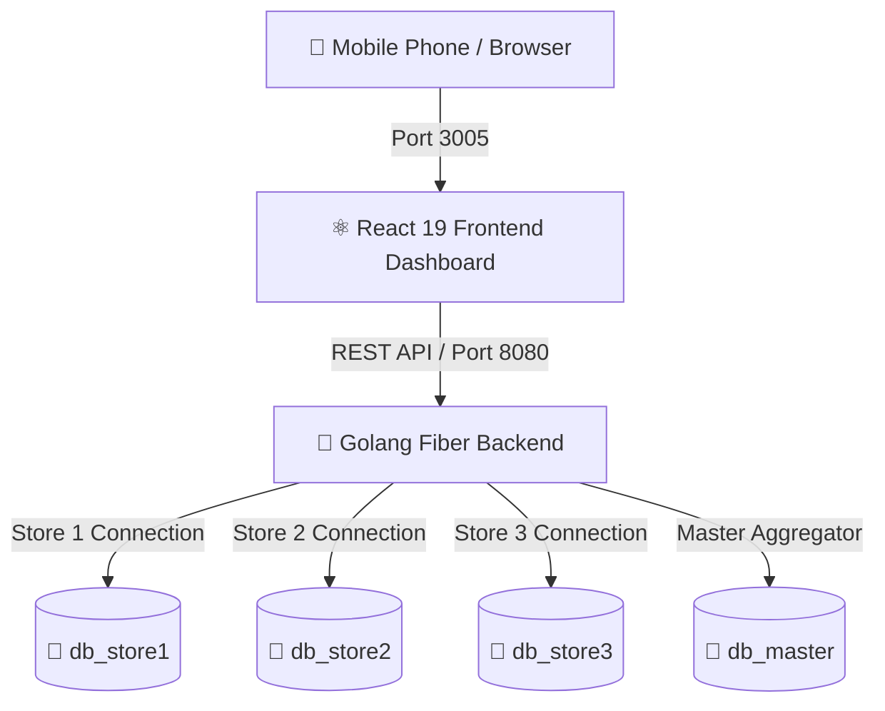

# 🌐 [🚀 CLICK HERE TO LAUNCH LIVE WEB APPLICATION](https://jbaskar2006-byte.github.io/Retail-System/)

# 🛍️ RetailSmart AI — Neural Retail Analytics & Management System

[](https://jbaskar2006-byte.github.io/Retail-System/)
[](https://golang.org)
[](https://react.dev)
[](https://www.mysql.com)

An **AI-driven, multi-territory retail analytics engine** built with a high-performance **Golang Fiber backend**, **MySQL multi-database architecture**, and a modern **React 19 Dashboard**. 

Designed for enterprise retail operations to monitor sales trends, inventory expiry, automated demand predictions, workforce attendance, and real-time auditable payroll across multiple store branches.

---

## 🌟 Key Features

- 🏪 **Multi-Store Territorial Architecture**:
  - **Store 1 (North)**, **Store 2 (South)**, **Store 3 (East)**, and **Master Aggregator Database**.
  - Isolated MySQL databases with synchronized master analytics engine.

- 💵 **Workforce Payroll & Compensation Engine**:
  - Visual stacked charts detailing **Basic Salary vs Performance Bonus**.
  - Multi-month historical audit filter ("April-2025", "March-2025", "All Months").
  - Live employee search and real-time total disbursed metrics.

- 📄 **Neural PDF Audit & Gmail Bridge**:
  - Auto-generates structured **PDF Attendance & Financial Audit Documents** client-side using `jspdf`.
  - Integrates a 10-second Neural Heartbeat timer with a one-click Gmail dispatch bridge.

- 📈 **Predictive AI & Inventory Forecasting**:
  - **Expiry Guard**: Identifies items expiring within 3 days and recommends discount clearance.
  - **Low Stock & Out-of-Stock Alerts**: Real-time warning triggers and auto-reorder suggestions.
  - **Demand Prediction**: Analyzes 7-day sales averages to predict stock run-out dates.

- 📱 **Mobile & Local Network Support**:
  - Dynamic host binding resolves `window.location.hostname` automatically.
  - Access the dashboard seamlessly from your PC (`http://localhost:3005`) or mobile phone (`http://10.86.44.15:3005`).

- ⚡ **Dedicated Non-Colliding Ports**:
  - Runs explicitly on **Port 3005** (Frontend) and **Port 8080** (Backend), preventing collisions with other applications (such as Hire AI on 5173/8000).

---

## 🏗️ System Architecture



---

## 📁 Repository Structure

```
retailsss/
├── database/
│   ├── schema.sql           # MySQL database schema (4 databases)
│   ├── seed.sql             # Demo datasets (products, workers, orders, salaries)
│   └── backend/             # Golang API backend
│       ├── main.go          # Core Fiber server & endpoint routing
│       ├── go.mod           # Go module definition
│       └── go.sum           # Dependency checksums
├── frontend/                # React 19 Dashboard App
│   ├── public/              # Static HTML & assets
│   ├── src/                 # Components, pages & API client
│   │   ├── api.js           # Dynamic Host API client
│   │   ├── pages/           # Dashboard, Salary, Revenue, Orders, etc.
│   │   └── context/         # StoreContext & voice alerts
│   └── .env                 # Port & Host configuration (PORT=3005)
├── start_system.bat         # One-click Windows starter script
├── .gitignore               # Excludes binaries, node_modules & temporary logs
└── README.md                # System documentation
```

---

## 🚀 Quick Start Guide

### Prerequisites
- **MySQL 8.0+** running locally (default credentials: `root` / `Root@123` on port 3306).
- **Go 1.22+** installed.
- **Node.js v18+** & **npm v10+** installed.

---

### Option A: One-Click Launch (Windows)

Simply double-click **`start_system.bat`** in the project root. The script will:
1. Initialize and seed all 4 MySQL databases (`db_store1`, `db_store2`, `db_store3`, `db_master`).
2. Launch the **Golang Backend API** on `http://localhost:8080`.
3. Launch the **React Dashboard** on `http://localhost:3005`.

---

### Option B: Manual Step-by-Step Setup

#### 1. Database Initialization
Import the schema and seed scripts into MySQL:
```bash
mysql -u root -pRoot@123 < database/schema.sql
mysql -u root -pRoot@123 < database/seed.sql
```

#### 2. Start Golang Backend API
```bash
cd database/backend
go run main.go
```
*Backend API will run on `http://localhost:8080`.*

#### 3. Start React Frontend Dashboard
```bash
cd frontend
npm start
```
*Frontend Dashboard will launch at `http://localhost:3005`.*

---

## 📱 Mobile & Local Wi-Fi Access

To access the system from your mobile phone or tablet on the same Wi-Fi network:

1. Find your laptop's local IP address (`ipconfig` in CMD, e.g. `10.86.44.15`).
2. Open your phone's browser and navigate to:
   ```
   http://<YOUR-LAPTOP-IP>:3005
   ```
   *Example: `http://10.86.44.15:3005`*

---

## 📡 API Endpoint Overview

| Endpoint | Method | Description |
| :--- | :--- | :--- |
| `/api/dashboard` | `GET` | Aggregated dashboard KPIs, system health score, and store summaries |
| `/api/analytics/salary` | `GET` | Auditable worker salary and bonus breakdown by store |
| `/api/analytics/revenue` | `GET` | Revenue, profit, and order channel splits (Online vs Store) |
| `/api/products` | `GET` | Product catalog with stock levels, cost margins, and expiry days |
| `/api/orders` | `GET / POST` | Retrieve order history or place a new order with auto stock reduction |
| `/api/inventory/refill`| `POST` | Restock product units for a specific store |
| `/api/alerts` | `GET` | System alert queue (Low stock, out of stock, workforce warnings) |
| `/api/health` | `GET` | System health check and MySQL database connectivity status |

---

## 🤝 Contributing

Contributions, issues, and feature requests are welcome! Feel free to check the [issues page](https://github.com/jbaskar2006-byte/Retail-System/issues).

---

## 📜 License

Distributed under the MIT License. See `LICENSE` for more information.
